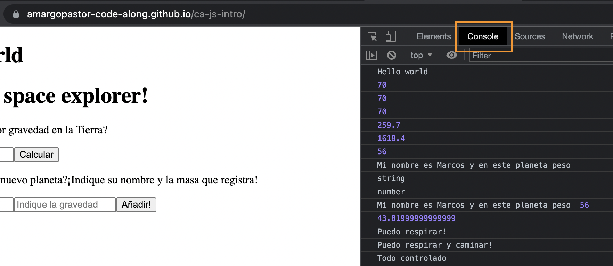

## Table of Contents

1. [Javascript](#1javascript)
1. [Añadir JS](#2añadir-js)
1. [Console.log()](#3consolelog)
1. [Herramientas de desarrollo](4herramientas-de-desarrollo)
1. [Variables](#5variables)
1. [Expresiones lógicas, boleans, if & else](#6expresiones-lógicas-boleans-if--else)
1. [Array + push() + pop()](#7array--push--pop)
1. [Comentarios](#8comentarios)
1. [Funciones](#9funciones)
1. [Bucle for](#10bucle-for)
1. [Documentación](#documentación)

## 1.Javascript

`JavaScript` es uno de los [lenguajes de programación más empleados](https://2020.stateofjs.com/en-us/demographics/) en el desarrollo web, móvil, juegos, etc. Abreviado comúnmente como JS se trata de un lenguaje de programación interpretado, dialecto del estándar ECMAScript. Se define como orientado a objetos,​ basado en prototipos, imperativo, débilmente tipado y dinámico.

¿Qué significa todo esto? ¡Pues muchas cosas! Pero no te preocupes. Esta es sólo una definición estándar que iremos entendiendo poco a poco. Lo importante viene ahora.

Sobre JS hay mucho que leer y mucho que aprender, pero es ideal si estás empezando en el mundo de la programación por una sencilla razón: se trata de un `lenguaje de alto nivel`. Es decir, su sintaxis es muy similar a la que usamos las personas por lo que en muchas ocasiones tendrás la sensación de estar escribiendo comandos en inglés para comunicarte con tu ordenador.

`La programación es un proceso` de que diseña, ordena e implementa un algoritmo a través de un lenguaje de programación.

`Algoritmo`: Secuencia de pasos ordenados que solucionan un problema.

Áreas de programación:

- Desarrollo Web
- Videojuegos
- Inteligencia Artificial
- Desarrollo Móvil
- Big Data
- Robótica
- (...)

`Lenguaje de programamción`: Sistema estructurado de comunicación, conformado por conjunto de palabras claves, símbolos y reglas sintácticas y semánticas que permiten un entendimiento entre el programador y la máquina.

Aprovecho para recomendarte que, para mantenerte al día de todo lo que se cuece en el mundo del JS, te dejes caer de vez en cuando por [stateofjs](https://2021.stateofjs.com/en-US/) y [ecma-international.org](https://www.ecma-international.org/publications-and-standards/standards/ecma-262/).

## 2.Añadir JS

Añadir JS a tu archivo de trabajo es fundamental. Supongamos, por el bien de este caso, vamos a ejecutar un archivo html en nuestro navegador que se acabará conviertiendo en una novísima página web con un conversor de peso espacial.

- Incluir JS en HTML:

```html
<body>
	<script>
		console.log('hola mundo');
	</script>
</body>
```

- Vincular un archivo `script.js` justo antes del cierre del cuerpo:

```html
<body>
	<h1>Hello world</h1>
	<script src="./src/script.js"></script>
</body>
```

## 3.Console.log()

La función `console.log()` indica al programa que debe imprimir un texto por consola, también llamada salida de programa.

```js
console.log('Hello world');
```

## 4.Herramientas de desarrollo

JavaScript se ejecuta en el lado del cliente de la web. Esto quiere decir que tendremos que tener siempre desplegadas nuestras `chrome dev tools`. Especialmente útil la pestaña de `Console`:



## 5.Variables

Una variable no es más que un espacio de memoria reservado dónde almacenaremos una determina información de manera temporal. Observa como con las siguientes variables de `tipo int` (numéricas) podemos ejecutar operaciones matemáticas:

```js
let mi_masa = 70;
let Tierra = 1;
let Marte = 3.71;
let Jupiter = 23.12;

console.log('Mi peso en la Tierra es:', mi_masa * Tierra);
console.log('Mi peso en la Marte es:', mi_masa * Marte);
console.log('Mi peso en la jupiter es:', mi_masa * Jupiter);

// intro es una variable de tipo string
let intro = 'Mi nombre es Marcos y en este planeta peso ';
console.log(typeof intro);

// Añadimos el peso de nuestro traje espacial
let space_suit = 0.2;

let data = mi_masa - mi_masa * Tierra * space_suit;
console.log(typeof data);

console.log(intro + data);
```

Dos variables no pueden tener el `mismo nombre`: si es el caso tendremos un error por pantalla:

```js
// Errores
let Tierra = 1.87;
let Tierra = 2.14;
console.log(mi_masa - mi_masa * Tierra * space_suit);
// Uncaught SyntaxError: Identifier 'Tierra' has already been declared
```

## 6.Expresiones lógicas, boleans, if & else

Los condicionales (o puertas lógicas) son herramientas del lenguaje de programación que nos permiten controlar el flujo de comportamiento de nuestro código:

```js
// oxigeno es una variable de tipo booleano
let oxigeno = true;

// si la varibla es true o false, variará el resultado mostrado por la pantalla
if (oxigeno) {
	console.log('Puedo respirar!');
} else {
	console.log('Ayudagghghghg!');
}

oxigeno = false;
if (oxigeno || space_suit) {
	console.log('Puedo respirar y caminar!');
} else {
	console.log('Ayudagghghghg!');
}

if (space_suit <= 0.2) {
	console.log('Todo controlado');
} else {
	console.log('No levanto cabeza!');
}

// La palabra reservada typeof nos devuelve el tipo de variable: string, boolean, array, int...
console.log(typeof space_suit);
console.log(typeof data);
console.log(typeof intro);
console.log(typeof oxigeno);
```

## 7.Array + push() + pop()

Una lista o `array` es una secuencia ordenada de datos. Estos datos pueden ser de x tipos. El `orden de los elementos en un array es importante`.

[Métodos de los arrays](https://developer.mozilla.org/es/docs/Web/JavaScript/Reference/Global_Objects/Array#).

```js
// dos formas distintas de declarar un array
let listado = [];
let listado2 = new Array();

let listadoPlanetas = [
	'Mercurio',
	'Venus',
	'Tierra',
	'Marte',
	'Júpiter',
	'Saturno',
	'Urano',
	'Neptuno',
	'Plutón',
];

console.log('Número total de planetas:', listadoPlanetas.length);
console.log('Planetas:', listadoPlanetas);
console.log('Primer planeta de la lista:', listadoPlanetas[0]);
console.log('Tercer planeta de la lista:', listadoPlanetas[2]);
```

> Observa como la posición 0 cuenta a la hora de invocar los elementos de un array

## 8.Comentarios

Indican al navegador que texto debe ser obviado.

## 9.Funciones

Una función es una sintaxis que usamos para encapsular un programa (entran unos datos y salen otros datos).`function` es una palabra reservada de javascript. Ventajas:

- Reutilizar código
- Abstracción

```js
console.log(
	'Mi nombre es Marcos y estoy de visita en el planeta',
	listadoPlanetas[0]
);
console.log(
	'Mi nombre es Marcos y estoy de visita en el planeta',
	listadoPlanetas[1]
);
console.log(
	'Mi nombre es Marcos y estoy de visita en el planeta',
	listadoPlanetas[2]
);

// Cuando definimos una función podemos pasarle parámetros con los que operar:
function reporte(i) {
	console.log(i);
	console.log(
		'Mi nombre es Marcos y estoy de visita en el planeta',
		listadoPlanetas[i]
	);
}

// Llamada a la función declarada con argumentos para que opere:
reporte(8);
```

## 10.Bucle for

Un bucle for es una herramienta que nos permite repetir una misma instrucción un número determinado de veces.

El bucle for se compone de 3 parámetros: instancia e inicialización de variable, condición que se comprueba en cada bluque y acción que se ejecuta al acabar el bucle (i++)

```js
for (let i = 0; i < 9; i++) {
	console.log(i);
	reporte(i);
}
```

```js
function reporte2(i) {
	if (i >= 0 && i < 9) {
		console.log(
			'Mi nombre es Marcos y estoy de visita en el planeta',
			listadoPlanetas[i]
		);
	} else {
		console.log('Usted ha abandonado el Sitema Solar');
	}
}

for (let i = 0; i < 10; i++) {
	console.log(i);
	reporte2(i);
}
```

## Documentación

### An introduction for new programmers

- [jsforcats](http://jsforcats.com/)
- [Métodos de los arrays](https://developer.mozilla.org/es/docs/Web/JavaScript/Reference/Global_Objects/Array#)

### Noticias JS

- [Ecma-international](https://www.ecma-international.org/)
- [stateJS](https://2020.stateofjs.com/en-US/)

### Entornos de desarrollo

- [brackets.io](http://brackets.io/)
- [atom.io](https://atom.io/)
- [sublimetext.com](http://www.sublimetext.com/)
- [visualstudio.com](https://code.visualstudio.com/Download)
- [lighttable](http://lighttable.com/)

### Tools

- [checkVarNames](https://mothereff.in/js-variables)

### Special thanks to

- [CORE CODE SCHOOL](https://www.corecode.school/)
- [Marc Pomar](https://github.com/boyander)

**[⬆ back to top](#table-of-contents)**
